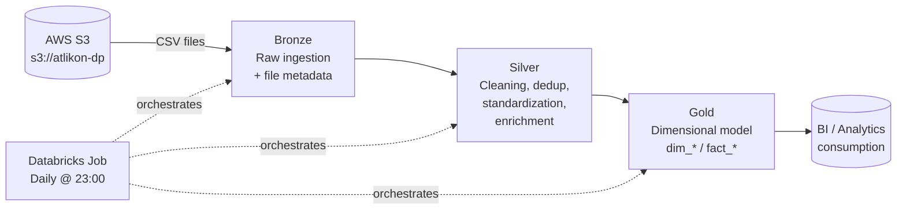
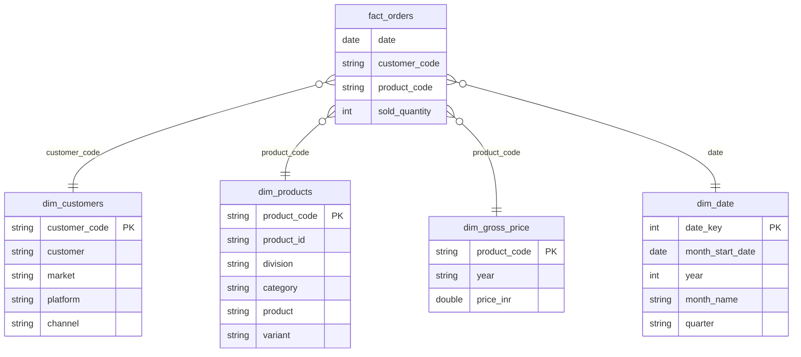

# Análisis FMCG en Databricks

Un **pipeline de ingeniería de datos** integral desarrollado en **Databricks** que ingesta datos de ventas sin procesar desde **AWS S3** y los transforma —siguiendo una **arquitectura Medallion** (Bronze → Silver → Gold)— en un **esquema en estrella** listo para el análisis, todo ello orquestado como un job diario de Databricks.

---

## 1. Descripción general

El flujo de procesamiento gestiona datos de ventas de productos de gran consumo (FMCG) de una unidad de negocio («Sports Bar» / productos de nutrición) provenientes de tres dominios de origen: 

| Dominio | Tipo | Patrón de carga |
|---|---|---|
| `customers` | Dimensión | Actualización completa |
| `products` | Dimensión | Actualización completa |
| `gross_price` | Dimensión | Actualización completa |
| `orders` | Fact | Carga completa y carga incremental diaria |

Los archivos CSV sin procesar llegan a un bucket de S3 (`s3://atlikon-dp/`), se ingieren en tablas Delta, se limpian y normalizan, y finalmente se modelan en un conjunto de tablas «Gold» (`dim_*` y `fact_*`) listas para su consumo en BI y análisis.

---

## 2. Arquitectura



**Responsabilidades de las capas:**

- **Bronze** — Ingesta de datos sin procesar desde S3 mediante un enfoque de solo anexado (o sobrescritura para dimensiones), capturando `read_timestamp`, `file_name` y `file_size` para fines de linaje y auditabilidad. En el caso de `orders`, también se implementa un patrón de movimiento de archivos de `landing/` a `processed/` para evitar el reprocesamiento de archivos.
- **Silver** — Desduplicación, conversión de tipos, normalización de cadenas y fechas, correcciones de calidad de datos basadas en reglas de negocio y uniones para enriquecimiento (p. ej., se combinan `orders` y `gross_price` con `products` para determinar un `product_code` estable).
- **Gold** — Modelo dimensional final (`dim_customers`, `dim_products`, `dim_gross_price`, `dim_date`, `fact_orders`), cargado mediante operaciones `MERGE` (upsert) de Delta que garantizan la idempotencia.

---

## 3. Modelo de datos

La capa *Gold* implementa un **esquema de estrella**:



**Nota sobre las tablas *gold* con prefijo "sb_":** Cada dominio se carga inicialmente en una tabla *gold* intermedia (`sb_dim_customers`, `sb_dim_products`, `sb_dim_gross_price`, `sb_fact_orders`) que representa una instantánea de la unidad de negocio; posteriormente, estos datos se integran mediante una operación `MERGE` en las tablas finales compartidas (`dim_customers`, `dim_products`, `dim_gross_price`, `fact_orders`). Este patrón de consolidación en dos etapas mantiene los datos *gold* de origen aislados del modelo unificado que consumen las herramientas de BI posteriores; se trata de un diseño pensado para escalar en caso de que se añadan más sistemas de origen o unidades de negocio en el futuro.

La tabla `fact_orders` se almacena con una **granularidad mensual** (`sold_quantity` agregada por mes, producto y cliente), a pesar de que los datos de origen (`orders`) llegan con granularidad diaria; el detalle diario se conserva en la tabla *silver* denominada `orders`.

---

## 4. Tecnologías utilizadas

- **Databricks** (notebooks, Unity Catalog de 3 niveles: `catalog.schema.table`, Databricks Jobs para la orquestación)
- **PySpark** — API de DataFrame para todas las transformaciones
- **Spark SQL** — lectura de tablas, validación ad-hoc, DDL de catálogo/esquema
- **Delta Lake** — operaciones `MERGE` (upserts), Change Data Feed, evolución del esquema (`mergeSchema`)
- **AWS S3** — landing zone para datos sin procesar

---

## 5. Estructura del repositorio

```
atlikon_project-development/
├── 1_setup/
│   ├── setup_catalogs.py            # Crea el catálogo y los esquemas bronze/silver/gold 
│   ├── utilities.py                 # Constantes de nombres de esquemas compartidos (presentes en todos los notebooks) 
│   └── dim_date_table_creation.py   # Construye la tabla gold dim_date
│
├── 2_dimension_data_processing/
│   ├── customers/                   # 1_bronze → 2_silver → 3_gold
│   ├── products/                    # 1_bronze → 2_silver → 3_gold
│   └── gross_price/                 # 1_bronze → 2_silver → 3_gold
│
└── 3_fact_data_processing/
    ├── orders_full_load/            # Carga inicial/total de pedidos
    │   ├── 1_orders_bronze_full_load.py
    │   ├── 2_orders_silver_full_load.py
    │   └── 3_orders_gold_full_load.py
    └── orders_incremental_load/     # Carga incremental diaria de pedidos
        ├── 1_orders_bronze_incremental_load.py
        ├── 2_orders_silver_incremental_load.py
        └── 3_orders_gold_incremental_load.py
```

Cada notebook `*_process.py` / `*_load.py` está parametrizado mediante widgets de Databricks (`catalog`, `data_source`), de modo que el mismo patrón lógico se reutiliza de forma coherente entre dominios y puede ejecutarse con distintos parámetros desde un único Job.

---

## 6. Detalles del Pipeline 

### 6.1 Configuración (`1_setup/`)
- Crea el catálogo `fmcg` y los esquemas `bronze`, `silver` y `gold`.
- Genera `dim_date` (con granularidad mensual y un rango de enero de 2024 a diciembre de 2025) directamente en la capa `gold`.
- `utilities.py` centraliza las constantes de los nombres de los esquemas, las cuales se importan mediante `%run` en cada notebook para evitar valores codificados directamente en el código (*hardcoding*).

### 6.2 Dimensiones (`2_dimension_data_processing/`)
Las tres dimensiones siguen el flujo **Bronze → Silver → Gold** con actualización completa (`mode("overwrite")`) en cada ejecución:

- **Customers**: eliminación de duplicados por `customer_id`, eliminación de espacios en blanco, estandarización de nombres de ciudades (corrigiendo errores ortográficos conocidos), aplicación de formato de mayúsculas iniciales (*title-casing*) y correcciones validadas por el negocio para ciudades faltantes mediante una tabla de referencia (*lookup*) curada manualmente, todo ello previo a la creación del atributo compuesto `customer` y a la operación de inserción/actualización (*upsert*) en `dim_customers`.
- **Products**: eliminación de duplicados por `product_id`, formato de mayúsculas iniciales para categorías, corrección ortográfica ("Protien" → "Protein"), mapeo de categoría a división, extracción de variantes mediante expresiones regulares (*regex*) y generación de un `product_code` determinista (hash SHA-256 del nombre del producto) utilizado como clave de unión estable en todo el modelo. Los `product_id` no numéricos o inválidos se asignan al valor predeterminado `999999` en lugar de descartarse, para evitar la pérdida de registros de hechos (*fact records*) en etapas posteriores del proceso.
- **Gross Price**: análisis (*parsing*) de fechas en múltiples formatos para la columna `month`, corrección de precios negativos, asignación de 0 a precios no numéricos, enriquecimiento con `product_code` mediante unión (*join*) con la tabla `products` y un paso de función de ventana (*window function*) en la capa Gold que selecciona el precio más reciente distinto de cero por cada `product_code` y año.

### 6.3 Facts (`3_fact_data_processing/orders_*`)
Dos variantes de la misma canalización lógica:

- **Carga completa** — utilizada para la carga histórica inicial. Lee todos los archivos de `landing/`, los añade a la capa *bronze* y realiza una operación `MERGE` completa hacia las capas *silver* y *gold*.
- **Carga incremental** — utilizada para la ejecución diaria. Lee únicamente los archivos recién llegados y los escribe en la capa *bronze* (mediante anexión) **y** en una tabla `staging_orders`; de este modo, las capas *silver* y *gold* solo reprocesan el segmento incremental (y no la tabla completa) antes de que se eliminen las tablas de *staging* al finalizar la ejecución.

Ambas variantes comparten la misma lógica de limpieza en la capa *silver*: filtrado de filas con un valor nulo en `order_qty`, asignación del valor predeterminado `999999` a los `customer_id` no numéricos, eliminación de los nombres de los días de la semana y análisis de múltiples formatos de fecha para `order_placement_date`, así como la eliminación de duplicados y el enriquecimiento con el `product_code`.

En la capa *gold*, ambas variantes:
1. Realizan una operación *upsert* en la tabla `sb_fact_orders` de nivel de origen (con granularidad diaria).
2. Reagregan los datos a una **granularidad mensual** y realizan un *upsert* en la tabla compartida `fact_orders`. La variante incremental se asegura de recalcular únicamente los meses afectados realmente por el lote entrante, en lugar de procesar toda la tabla de hechos.

---

## 7. Orquestación

Un **Databricks Job** ejecuta la canalización completa diariamente a las **23:00**, procesando los *notebooks* según el orden de dependencia: setup (una sola vez) → dimensiones (clients, products, gross price) → orders (carga incremental). Actualmente, la definición del trabajo reside en el espacio de trabajo de Databricks. 

---

## 8. Reproducir el proyecto

1. Configurar una ubicación externa o un perfil de instancia en Databricks con acceso de lectura al bucket de S3.
2. Ejecutar `1_setup/setup_catalogs.py` para crear el catálogo y los esquemas.
3. Ejecutar `1_setup/dim_date_table_creation.py`.
4. Ejecutar los notebooks de las capas bronze → silver → gold para cada dimensión (`customers`, `products`, `gross_price`, en ese orden, ya que `orders` depende de `products`).
5. Ejecutar `3_fact_data_processing/orders_full_load/` una vez para realizar la carga histórica (backfill) de `fact_orders`.
6. Programar `3_fact_data_processing/orders_incremental_load/` (bronze → silver → gold, en orden) como un trabajo (Job) diario en Databricks.

---

## 9. Prácticas clave de ingeniería demostradas

- Arquitectura Medallion (Bronce/Plata/Oro) con una clara separación de responsabilidades por capa.
- Carga incremental e idempotente mediante la operación `MERGE` (upsert) de Delta, evitando sobrescrituras ciegas.
- Funcionalidad *Change Data Feed* habilitada en todas las tablas para posibles consumidores CDC posteriores.
- Gestión explícita de la evolución del esquema (`mergeSchema`).
- Patrón de archivos *landing* y *processed* ​​para garantizar que la ingesta sea segura ante reintentos.
- Tablas de *staging* para limitar las transformaciones incrementales únicamente a los datos nuevos.
- Gestión de la calidad de los datos basada en la realidad de datos imperfectos: duplicados, formatos inconsistentes, errores ortográficos, identificadores no válidos, valores negativos y valores faltantes resueltos mediante mapeos validados por el negocio.
- Claves subrogadas deterministas (`product_code` basado en hash) para mantener la estabilidad de las uniones (*joins*) de dimensiones tras recargas de datos.
- Notebooks reutilizables y parametrizados (mediante *widgets*) en lugar de scripts específicos para cada fuente de datos.
